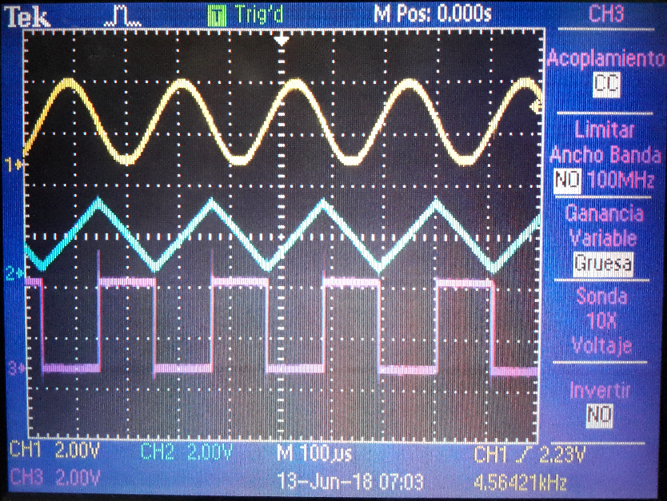
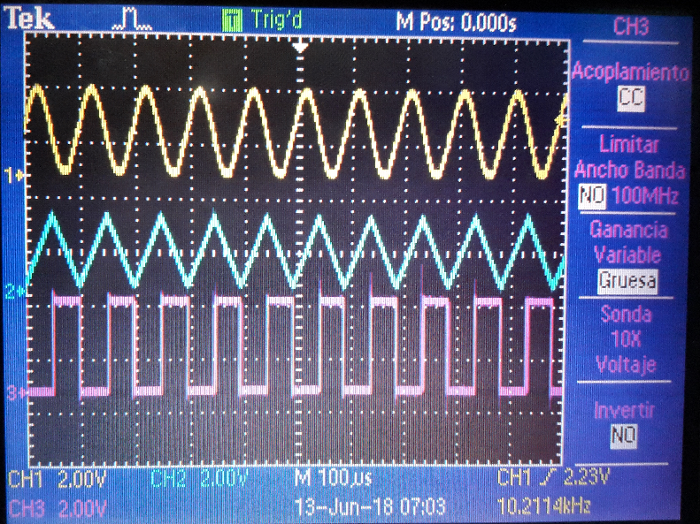

# Signal Generator on CortexM
A simple signal generator using an ARM Cortex-M4 microcontroller

### Overview
This was made specifically for the [NUCLEO-F303RE development kit](https://www.st.com/en/evaluation-tools/nucleo-f303re.html) using STM CubeMX to configure the board and ARM Keil v5 to program it.

The idea behind this is quite easy, use microcontroller's DAC and one single digital output to make three kinds of outputs:
 - sine wave, PA5 pin, DAC's channel 2
 - triangular wave, PA4 pin, DAC's channel 1 
 - squared wave, PA6 pin
as you can see at the [configuration file](sindac.ioc).

The program flowchart ([english version](flowchart_eng.png) or [spanish version](flowchart.png)) shows how the program works

On this board working at 36MHz the APB1 (max clock speed for the DAC bus) and this program, the output can go from 835Hz up to 11.29KHz with nice waveforms.

Here are some photos taked from a Tektronic osciloscope:

